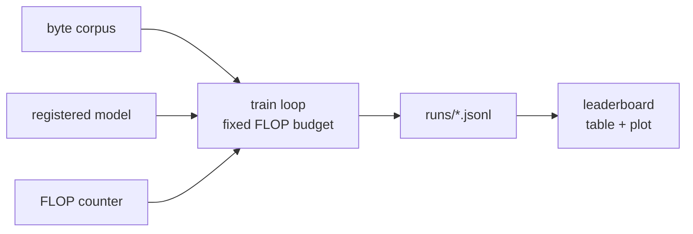

# The baseline harness (Task 0.1)

The foundation every candidate plugs into. This document is the **contract**: a
new mechanism is added by reading *this*, not the harness source. It is amortized
(train/val) for now; the prequential/online mode and inference-FLOP accounting are
Task 0.2, built on top of these same interfaces without redesign.

The one metric is **validation bits-per-byte at a fixed training-FLOP budget** on
a tiny byte-level corpus. Lower bpb at equal FLOPs wins; nothing else counts.



## 1. Model interface & registry

`smolml/models/registry.py`. The harness only ever speaks to a model through
`LanguageModel`, so it never needs to know the mechanism behind a name.

```python
class LanguageModel(nn.Module, abc.ABC):
    config: object                                   # the model's own config dataclass

    def forward(self, idx: Tensor) -> Tensor: ...    # (B, T) int64 -> (B, T, 256) float logits
    def flops(self, seq_len: int) -> FlopBreakdown:  # analytic FLOPs for ONE sequence
    @classmethod
    def from_config(cls, config: dict) -> "LanguageModel": ...
    def num_params(self) -> int                      # provided; tied tensors counted once

    # Provided defaults (override for a non-backprop candidate — ADR 0003):
    def configure_optimizer(self, *, lr, weight_decay, betas) -> Optimizer  # default AdamW
    def train_step(self, batch, optimizer, *, grad_clip) -> tuple[Tensor, FlopBreakdown]
```

- **Vocabulary is fixed at 256** (raw byte values) — no tokenizer choices. `forward`
  returns **logits** (not probabilities); the loss applies softmax.
- `flops(seq_len)` returns a `FlopBreakdown` (see §2). It is **analytic** — derived
  from the config, not profiled — so it is deterministic and hand-checkable.
  `forward` is the forward cost; `backward` is *this model's own* update cost per
  sequence (2× forward for backprop).
- `from_config(dict)` rebuilds the model from the resolved config dict stored in
  the run log, so runs are reproducible.
- **The learning seam (the source-(iv) hook):** `train_step` runs one learning
  step and **returns the FLOPs it actually spent**; the harness accumulates *that*
  against the budget. A backprop model uses the default (forward + cross-entropy +
  backward + step, charging `flops(T).scale(B)`). A non-backprop candidate
  overrides `train_step`/`configure_optimizer` to express its own rule and its own
  honest cost — so it is **never charged the 2× backprop tax** it does not pay.

### Registry API

```python
register_model(name)        # class decorator: register a LanguageModel subclass
get_model(name)  -> type    # look up a class
list_models()    -> list[str]
build_model(name, config: dict) -> LanguageModel   # what the harness calls
```

### Adding a candidate (zero harness changes)

```python
from smolml.flops import FlopBreakdown, linear_flops
from smolml.models.registry import LanguageModel, register_model

@register_model("my_mechanism")
class MyMechanism(LanguageModel):
    def __init__(self, config: MyConfig):
        super().__init__()
        self.config = config
        ...  # nn.Module layers

    def forward(self, idx):           # (B,T) -> (B,T,256) logits
        ...

    def flops(self, seq_len):         # compose smolml.flops primitives — see §2
        fwd = ...                     # forward matmul FLOPs for one sequence
        return FlopBreakdown.from_forward(fwd)

    @classmethod
    def from_config(cls, config):
        return cls(MyConfig(**config))
```

Then it runs under the existing train loop, eval, and leaderboard. The **only**
rule is: account for compute through the shared `smolml.flops` primitives so the
referee is identical for every entrant. A **backprop** candidate stops here. A
**non-backprop** one also overrides `train_step` (and optionally
`configure_optimizer`) to apply its own learning rule and return its own honest
`FlopBreakdown` — the harness charges exactly what it reports.

## 2. The FLOP counter (the critical correctness surface)

`smolml/flops.py`. A bug here silently invalidates every comparison, so the
accounting is explicit and unit-tested against hand-computed values
(`tests/test_flops.py`).

### Conventions (assumptions, made explicit)

- **MAC = 2 FLOPs** — a multiply-accumulate is 1 multiply + 1 add.
- **Matmul `(m,k)·(k,n) -> (m,n)` costs `2·m·n·k`** — `m·n` outputs, each a length-`k`
  dot product (`k` MACs).
- **Counted: whatever dominates the mechanism.** For the transformer (and the
  Phase-A fast-weight memory, whose reads/writes are outer-products/matvecs =
  matmuls) that is the matmuls — linear/projection layers (`O(tokens·d²)`) and the
  attention score/value matmuls (`O(tokens²·d)`).
- **Omitted — and the condition for omitting:** elementwise ops (activations,
  RMSNorm, residual adds, softmax normalization, RoPE rotations, dropout) and
  embedding gathers — omitted **only because they are dominated by the matmuls**
  here (`O(tokens·d)` vs. `O(tokens·d²)`), and counting them exactly is
  framework-dependent without moving the metric. **This omission is conditional,
  not universal:** a mechanism whose dominant compute is *not* matmuls (e.g. the
  Task 0.3 online context-mixer — table lookups + logistic mixing) MUST charge
  that work via `pointwise_flops`/`gather_flops`, or the instrument would score it
  as nearly free.
- **Backward = 2× forward (matmul FLOPs).** For `Y = A·B` with both operands
  feeding gradients, backprop computes `dA = dY·Bᵀ` and `dB = Aᵀ·dY` — two matmuls
  of the same magnitude as the forward one. So a training step costs
  `forward + 2·forward = 3·forward`. This is exactly the textbook **`C ≈ 6·N·D`**
  rule (2 FLOPs/param/token forward, 4 backward), generalized to also charge the
  attention activation matmuls.

### API

```python
MAC_FLOPS = 2
BACKWARD_MULTIPLIER = 2

matmul_flops(m, n, k)                        -> int   # 2*m*n*k
linear_flops(tokens, in_features, out_features) -> int  # Linear over `tokens` rows
causal_attention_flops(seq_len, d_model)     -> int   # scores + value mixing, one layer
pointwise_flops(n_elems, per_elem=1)         -> int   # elementwise arithmetic (non-matmul)
gather_flops(n, cost_per_lookup=1)           -> int   # nominal table-lookup cost (non-matmul)

@dataclass(frozen=True)
class FlopBreakdown:
    forward: int
    backward: int
    total            # forward + backward (one training step)
    __add__, scale(factor)
    from_forward(forward)   # charges BACKWARD_MULTIPLIER * forward
```

`pointwise_flops`/`gather_flops` exist for **non-matmul-dominated** mechanisms
(e.g. Task 0.3's context-mixer); the transformer does not use them.

**Extensibility toward Task 0.2 — an extension, not free.** `forward`/`backward`
are kept separate and the primitives are reusable, so the prequential/total-FLOP
mode (ADR 0004) builds on this rather than replacing it. But prediction and
test-time adaptation are *context-length dependent*: Task 0.2 will **add** methods
like `decode_step_flops(context_len)` and `adapt_step_flops(context_len)` to the
interface (and generalize `train_step` to an `adapt` path). Those are deliberately
**not** implemented in 0.1.

### Derivation — transformer baseline `flops(T)`

Let `d = d_model`, `L = n_layers`, `d_ff` = FFN hidden, `V = 256`, sequence length
`T`. (Head count does **not** affect attention FLOPs — see below.) Per layer, per
sequence, forward matmul FLOPs:

| term | shape | FLOPs |
| --- | --- | --- |
| qkv projection | Linear(d → 3d) over T | `2·T·(3d)·d = 6·d²·T` |
| output projection | Linear(d → d) over T | `2·d²·T` |
| FFN (up + down) | Linear(d→d_ff)+Linear(d_ff→d) | `4·d·d_ff·T` |
| attention (scores + value) | causal | `4·d·P`, `P = T(T+1)/2` |

**Attention is head-count independent and causal-aware.** With `h` heads of width
`d_head = d/h`, query `i` attends keys `0..i`, so the number of (query,key) pairs
over a sequence is `P = T(T+1)/2`. Each pair is one length-`d_head` dot product per
head for `Q·Kᵀ` and one for value mixing; summed over `h` heads the `d_head`
factors recombine to `d` — so the count depends only on `d_model`:
`Q·Kᵀ = 2·d·P`, `softmax·V = 2·d·P`, total `4·d·P`.

Whole model, per sequence:

```
forward  = L·(8·d²·T + 4·d·d_ff·T + 4·d·P) + 2·d·V·T   # blocks + LM head
backward = 2 · forward
total    = 3 · forward
```

**Worked tiny example** (`d=8, L=2, d_ff=16, V=256, T=4`; `P = 10`):
per-layer `1536 + 512 + 2048 + 320 = 4416`; blocks `8832`; head `16384`;
`forward = 25216`, `backward = 50432`, `total = 75648`. This exact triple is
asserted in `tests/test_flops.py` and against `Transformer.flops(4)`.

The train loop accumulates the `FlopBreakdown` that `train_step` **returns** (for
the transformer, `flops(seq_len).scale(batch_size)`). The budget is a **ceiling**:
a step runs only if it still fits, so `total_flops <= flop_budget` always.

## 3. Run logging — the JSONL schema

`smolml/train.py` writes one run to `runs/<run>.jsonl`, one JSON object per line.

- **Line 1 — meta:** run identity, the **resolved** model config (defaults filled
  in, so it reproduces exactly), and every training hyperparameter:
  ```json
  {"type":"meta","run":"...","model":"transformer","config":{"d_model":64,...},
   "params":164288,"device":"cpu","seed":0,"flop_budget":5e10,"batch_size":16,
   "seq_len":64,"eval_seq_len":128,"eval_batches":8,"eval_interval":50,
   "val_fraction":0.1,"lr":0.003,"weight_decay":0.1,"betas":[0.9,0.95],
   "grad_clip":1.0,"started_at":1750000000.0}
  ```
- **Each later line — step:**
  ```json
  {"type":"step","wallclock":3.2,"step":47,"cumulative_flops":50924523520,
   "train_loss":3.91,"val_bpb":3.80}
  ```
  - `wallclock` — seconds since training started,
  - `step` — optimizer steps taken,
  - `cumulative_flops` — **training** FLOPs (forward + the model's update) spent so far,
  - `train_loss` — mini-batch loss in **bits/byte** (same unit as `val_bpb`, so the
    two curves are directly comparable),
  - `val_bpb` — validation bits-per-byte at this step.

A step line is written every `eval_interval` steps and always once more at the
end; if the budget is too small for even one step, a single step-0 line (0 FLOPs,
init losses) is still written. **The budget is on training FLOPs only**; the
validation forward pass is a measurement, not charged (amortized protocol — Task
0.2 will count inference/adaptation FLOPs into a *total*-FLOP budget).

**Validation uses a fixed `eval_seq_len` and window count for every run**,
independent of the training `seq_len`, because bpb depends on conditioning length
— so two runs are only comparable when they share an eval protocol.

## 4. The leaderboard

`smolml/leaderboard.py` reads every `runs/*.jsonl`, sorts by final `val_bpb`
(lowest first), renders a markdown table — with `eval ctx`, `val%`, and `budget`
columns — and plots each run's bpb-vs-training-FLOPs trajectory on a log-x axis,
saved as a PNG.

```python
collect_runs(runs_dir) -> list[RunRecord]
build_table(records)   -> str           # markdown (with protocol columns + warnings)
protocol_warnings(records) -> list[str] # comparability warnings
plot_bpb_vs_flops(records, out_png) -> Path
regenerate(runs_dir, table_path=None, plot_path="runs/leaderboard.png") -> (table, png)
```

**Ranking is only fair within one eval protocol AND one FLOP budget.** Ranking by
final bpb across different budgets is apples-to-oranges (more budget → lower bpb
trivially), so `build_table` prepends a `> WARNING:` line when runs differ on
`(eval_seq_len, val_fraction)` or on `flop_budget`. The bpb-vs-FLOP **plot** spans
budgets on purpose (that is the curve); the **table** ranking does not. Corpus
identity is not auto-tracked — only compare runs on the same corpus.

Regenerate after new runs land — it is reproducible and never hand-edited.

## Caveats (known gaps; do not over-read small deltas)

- **Single-seed.** Runs here are single-seed point estimates. On a tiny corpus a
  small bpb gap can be within seed noise. Before trusting a small delta, an N-seed
  mean±spread wrapper is required (lands in the real training-run phase).
- **Determinism is CPU-only.** With a fixed seed, CPU runs are bit-reproducible
  (asserted in `tests/test_metric_guards.py`). GPU (cuda/mps) kernels are **not**
  pinned deterministic; treat reproducibility guarantees as CPU-only for now.

## How to run

Everything via `uv run` (never bare `python`). Device auto-detects **cuda > mps >
cpu**; the metric is FLOP-based so the device only changes wall-clock.

```bash
uv sync                                   # create the env (CPU torch wheel; see pyproject)

# train a run to a fixed FLOP budget (defaults: bundled sample, transformer).
# --eval-seq-len fixes the comparison context; keep it identical across a run set.
uv run smolml train --data sample --d-model 64 --layers 3 --budget 5e10 \
    --seq-len 64 --eval-seq-len 64 --run-name baseline-sample-d64

# the real corpus is opt-in (network); tests never need it
uv run smolml train --data enwik8 --enwik8-bytes 5000000 --budget 1e13

# CI-scale synthetic text8 clone (no network)
uv run smolml train --data synthetic --synthetic-bytes 1000000 --budget 1e11

# regenerate the leaderboard table + plot from all run logs
uv run smolml leaderboard --runs-dir runs --table runs/leaderboard.md --plot runs/leaderboard.png
```

### Data sources (`smolml/data/`)

- `load_sample()` — tiny bundled English sample committed under the package; used
  by tests and the offline smoke run. **No network.**
- `synthetic_text8(n_bytes, seed)` — deterministic, scaled `text8`-style clone
  (lowercase + space) for CI-scale runs. **No network.**
- `prepare_enwik8(cache_dir, n_bytes=None)` — the real corpus; **opt-in** network
  download. Tests never call it.

All sources yield a `ByteCorpus`; `ByteCorpus.split(val_fraction)` is a
deterministic tail split (val is the final fraction; no shuffling, no leakage).

## Gates

```bash
uvx ruff format --check
uvx ruff check
uv run pytest
```
