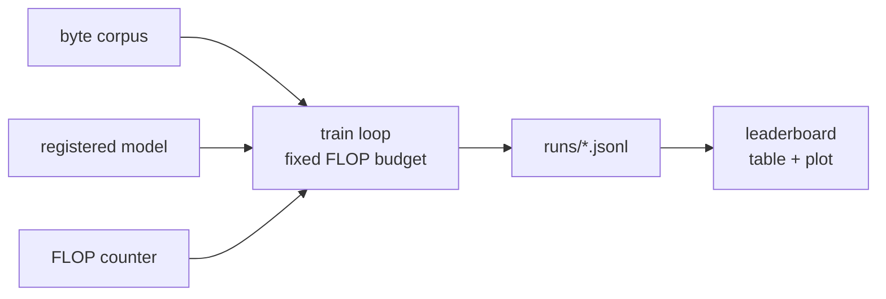
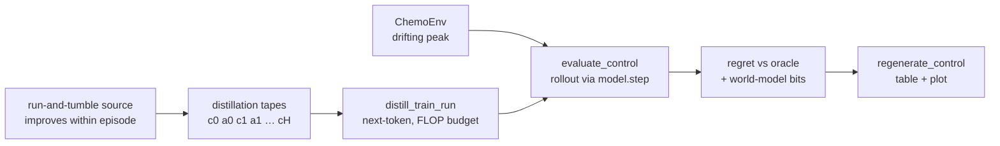

# The measurement harness (Tasks 0.1 + 0.2 + C.A.0)

The foundation every candidate plugs into. This document is the **contract**: a
new mechanism is added by reading *this*, not the harness source. Three evaluation
modes share one model interface and one FLOP counter: the **amortized** train/val
harness (§1–§4), the **prequential / online** mode with total-FLOP accounting
(§5, Task 0.2), and the **control rung** — in-context RL on a feedback task
(§6, Task C.A.0) — all built on the same interfaces.

The one metric is **bits-per-byte at a fixed FLOP budget** on a tiny byte-level
corpus — training FLOPs (amortized) or total FLOPs incl. inference + adaptation
(prequential). Lower bpb at equal FLOPs wins; nothing else counts.



## 1. Model interface & registry

`smolml/models/registry.py`. The harness only ever speaks to a model through
`LanguageModel`, so it never needs to know the mechanism behind a name.

```python
class LanguageModel(nn.Module, abc.ABC):
    config: object                                   # the model's own config dataclass

    def forward(self, idx: Tensor) -> Tensor: ...    # (B, T) int64 -> (B, T, 256) float logits
    def flops(self, seq_len: int) -> FlopBreakdown:  # analytic FLOPs for ONE sequence
    @classmethod
    def from_config(cls, config: dict) -> "LanguageModel": ...
    def num_params(self) -> int                      # provided; tied tensors counted once

    # Provided defaults (override for a non-backprop candidate — ADR 0003):
    def configure_optimizer(self, *, lr, weight_decay, betas) -> Optimizer  # default AdamW
    def train_step(self, batch, optimizer, *, grad_clip) -> tuple[Tensor, FlopBreakdown]
```

- **Vocabulary is fixed at 256** (raw byte values) — no tokenizer choices. `forward`
  returns **logits** (not probabilities); the loss applies softmax.
- `flops(seq_len)` returns a `FlopBreakdown` (see §2). It is **analytic** — derived
  from the config, not profiled — so it is deterministic and hand-checkable.
  `forward` is the forward cost; `backward` is *this model's own* update cost per
  sequence (2× forward for backprop).
- `from_config(dict)` rebuilds the model from the resolved config dict stored in
  the run log, so runs are reproducible.
- **The learning seam (the source-(iv) hook):** `train_step` runs one learning
  step and **returns the FLOPs it actually spent**; the harness accumulates *that*
  against the budget. A backprop model uses the default (forward + cross-entropy +
  backward + step, charging `flops(T).scale(B)`). A non-backprop candidate
  overrides `train_step`/`configure_optimizer` to express its own rule and its own
  honest cost — so it is **never charged the 2× backprop tax** it does not pay.

### Registry API

```python
register_model(name)        # class decorator: register a LanguageModel subclass
get_model(name)  -> type    # look up a class
list_models()    -> list[str]
build_model(name, config: dict) -> LanguageModel   # what the harness calls
```

### Adding a candidate (zero harness changes)

```python
from smolml.flops import FlopBreakdown, linear_flops
from smolml.models.registry import LanguageModel, register_model

@register_model("my_mechanism")
class MyMechanism(LanguageModel):
    def __init__(self, config: MyConfig):
        super().__init__()
        self.config = config
        ...  # nn.Module layers

    def forward(self, idx):           # (B,T) -> (B,T,256) logits
        ...

    def flops(self, seq_len):         # compose smolml.flops primitives — see §2
        fwd = ...                     # forward matmul FLOPs for one sequence
        return FlopBreakdown.from_forward(fwd)

    @classmethod
    def from_config(cls, config):
        return cls(MyConfig(**config))
```

Then it runs under the existing train loop, eval, and leaderboard. The **only**
rule is: account for compute through the shared `smolml.flops` primitives so the
referee is identical for every entrant. A **backprop** candidate stops here. A
**non-backprop** one also overrides `train_step` (and optionally
`configure_optimizer`) to apply its own learning rule and return its own honest
`FlopBreakdown` — the harness charges exactly what it reports.

## 2. The FLOP counter (the critical correctness surface)

`smolml/flops.py`. A bug here silently invalidates every comparison, so the
accounting is explicit and unit-tested against hand-computed values
(`tests/test_flops.py`).

### Conventions (assumptions, made explicit)

- **MAC = 2 FLOPs** — a multiply-accumulate is 1 multiply + 1 add.
- **Matmul `(m,k)·(k,n) -> (m,n)` costs `2·m·n·k`** — `m·n` outputs, each a length-`k`
  dot product (`k` MACs).
- **Counted: whatever dominates the mechanism.** For the transformer (and the
  Phase-A fast-weight memory, whose reads/writes are outer-products/matvecs =
  matmuls) that is the matmuls — linear/projection layers (`O(tokens·d²)`) and the
  attention score/value matmuls (`O(tokens²·d)`).
- **Omitted — and the condition for omitting:** elementwise ops (activations,
  RMSNorm, residual adds, softmax normalization, RoPE rotations, dropout) and
  embedding gathers — omitted **only because they are dominated by the matmuls**
  here (`O(tokens·d)` vs. `O(tokens·d²)`), and counting them exactly is
  framework-dependent without moving the metric. **This omission is conditional,
  not universal:** a mechanism whose dominant compute is *not* matmuls (e.g. the
  Task 0.3 online context-mixer — table lookups + logistic mixing) MUST charge
  that work via `pointwise_flops`/`gather_flops`, or the instrument would score it
  as nearly free.
- **Backward = 2× forward (matmul FLOPs).** For `Y = A·B` with both operands
  feeding gradients, backprop computes `dA = dY·Bᵀ` and `dB = Aᵀ·dY` — two matmuls
  of the same magnitude as the forward one. So a training step costs
  `forward + 2·forward = 3·forward`. This is exactly the textbook **`C ≈ 6·N·D`**
  rule (2 FLOPs/param/token forward, 4 backward), generalized to also charge the
  attention activation matmuls.

### API

```python
MAC_FLOPS = 2
BACKWARD_MULTIPLIER = 2

matmul_flops(m, n, k)                        -> int   # 2*m*n*k
linear_flops(tokens, in_features, out_features) -> int  # Linear over `tokens` rows
causal_attention_flops(seq_len, d_model)     -> int   # scores + value mixing, one layer
pointwise_flops(n_elems, per_elem=1)         -> int   # elementwise arithmetic (non-matmul)
gather_flops(n, cost_per_lookup=1)           -> int   # nominal table-lookup cost (non-matmul)

@dataclass(frozen=True)
class FlopBreakdown:
    forward: int
    backward: int
    total            # forward + backward (one training step)
    __add__, scale(factor)
    from_forward(forward)   # charges BACKWARD_MULTIPLIER * forward
```

`pointwise_flops`/`gather_flops` exist for **non-matmul-dominated** mechanisms
(e.g. Task 0.3's context-mixer); the transformer does not use them.

**Extensibility toward Task 0.2 — an extension, not free.** `forward`/`backward`
are kept separate and the primitives are reusable, so the prequential/total-FLOP
mode (ADR 0004) builds on this rather than replacing it. But prediction and
test-time adaptation are *context-length dependent*: Task 0.2 will **add** methods
like `decode_step_flops(context_len)` and `adapt_step_flops(context_len)` to the
interface (and generalize `train_step` to an `adapt` path). Those are deliberately
**not** implemented in 0.1.

### Derivation — transformer baseline `flops(T)`

Let `d = d_model`, `L = n_layers`, `d_ff` = FFN hidden, `V = 256`, sequence length
`T`. (Head count does **not** affect attention FLOPs — see below.) Per layer, per
sequence, forward matmul FLOPs:

| term | shape | FLOPs |
| --- | --- | --- |
| qkv projection | Linear(d → 3d) over T | `2·T·(3d)·d = 6·d²·T` |
| output projection | Linear(d → d) over T | `2·d²·T` |
| FFN (up + down) | Linear(d→d_ff)+Linear(d_ff→d) | `4·d·d_ff·T` |
| attention (scores + value) | causal | `4·d·P`, `P = T(T+1)/2` |

**Attention is head-count independent and causal-aware.** With `h` heads of width
`d_head = d/h`, query `i` attends keys `0..i`, so the number of (query,key) pairs
over a sequence is `P = T(T+1)/2`. Each pair is one length-`d_head` dot product per
head for `Q·Kᵀ` and one for value mixing; summed over `h` heads the `d_head`
factors recombine to `d` — so the count depends only on `d_model`:
`Q·Kᵀ = 2·d·P`, `softmax·V = 2·d·P`, total `4·d·P`.

Whole model, per sequence:

```
forward  = L·(8·d²·T + 4·d·d_ff·T + 4·d·P) + 2·d·V·T   # blocks + LM head
backward = 2 · forward
total    = 3 · forward
```

**Worked tiny example** (`d=8, L=2, d_ff=16, V=256, T=4`; `P = 10`):
per-layer `1536 + 512 + 2048 + 320 = 4416`; blocks `8832`; head `16384`;
`forward = 25216`, `backward = 50432`, `total = 75648`. This exact triple is
asserted in `tests/test_flops.py` and against `Transformer.flops(4)`.

The train loop accumulates the `FlopBreakdown` that `train_step` **returns** (for
the transformer, `flops(seq_len).scale(batch_size)`). The budget is a **ceiling**:
a step runs only if it still fits, so `total_flops <= flop_budget` always.

## 3. Run logging — the JSONL schema

`smolml/train.py` writes one run to `runs/<run>.jsonl`, one JSON object per line.

- **Line 1 — meta:** run identity, the **resolved** model config (defaults filled
  in, so it reproduces exactly), and every training hyperparameter:
  ```json
  {"type":"meta","run":"...","model":"transformer","config":{"d_model":64,...},
   "params":164288,"device":"cpu","seed":0,"flop_budget":5e10,"batch_size":16,
   "seq_len":64,"eval_seq_len":128,"eval_batches":8,"eval_interval":50,
   "val_fraction":0.1,"lr":0.003,"weight_decay":0.1,"betas":[0.9,0.95],
   "grad_clip":1.0,"started_at":1750000000.0}
  ```
- **Each later line — step:**
  ```json
  {"type":"step","wallclock":3.2,"step":47,"cumulative_flops":50924523520,
   "train_loss":3.91,"val_bpb":3.80}
  ```
  - `wallclock` — seconds since training started,
  - `step` — optimizer steps taken,
  - `cumulative_flops` — **training** FLOPs (forward + the model's update) spent so far,
  - `train_loss` — mini-batch loss in **bits/byte** (same unit as `val_bpb`, so the
    two curves are directly comparable),
  - `val_bpb` — validation bits-per-byte at this step.

A step line is written every `eval_interval` steps and always once more at the
end; if the budget is too small for even one step, a single step-0 line (0 FLOPs,
init losses) is still written. **The budget is on training FLOPs only**; the
validation forward pass is a measurement, not charged (amortized protocol — Task
0.2 will count inference/adaptation FLOPs into a *total*-FLOP budget).

**Validation uses a fixed `eval_seq_len` and window count for every run**,
independent of the training `seq_len`, because bpb depends on conditioning length
— so two runs are only comparable when they share an eval protocol.

## 4. The leaderboard

`smolml/leaderboard.py` reads every `runs/*.jsonl`, sorts by final bpb (lowest
first), and renders a **protocol-aware** markdown table (`protocol`, `params`,
`final FLOPs`, `final bpb`, and a per-protocol `detail`) plus a log-x plot. Each
run is a bpb-vs-FLOPs trajectory: x is cumulative *training* FLOPs for amortized
runs and cumulative *total* FLOPs for prequential runs; amortized lines are solid,
prequential dashed.

```python
collect_runs(runs_dir) -> list[RunRecord]
build_table(records)   -> str           # markdown (protocol-aware + warnings)
protocol_warnings(records) -> list[str] # comparability warnings
plot_bpb_vs_flops(records, out_png) -> Path
regenerate(runs_dir, table_path=None, plot_path="runs/leaderboard.png") -> (table, png)
```

**Ranking is only fair within one protocol, one eval protocol, and one FLOP
budget.** Amortized val bpb and prequential bpb are different numbers; ranking
across budgets is apples-to-oranges (more budget → lower bpb trivially). So
`build_table` prepends a `> WARNING:` line when runs span multiple protocols,
amortized `(eval_seq_len, val_fraction)`, or budgets. The **plot** spans budgets
and both protocols on purpose (that is the curve); the **table** ranking does not.
Corpus identity is not auto-tracked — only compare runs on the same corpus.

Regenerate after new runs land — it is reproducible and never hand-edited.

## 5. Prequential / online mode + total-FLOP accounting (Task 0.2)

The real metric (ADR 0004): predict each byte **before** it is revealed, pay
−log₂ p bits, then *may* adapt; score cumulative bpb against a **total**-FLOP
budget (pretraining + inference + adaptation). The amortized path (§1–§4) is
unchanged and still works.

### The per-byte seam — ONE honest channel

`LanguageModel` exposes a single per-byte method (plus state init), so there is no
separate predict method that could do real work charged 0 FLOPs:

```python
context_window(self) -> int | None              # bytes conditioned on per prediction (None = unbounded)
init_prequential_state(self) -> DecodeState     # fresh per-stream state
step(self, state, revealed_byte, pos) -> (state, next_logits, FlopBreakdown)
    # fold the revealed byte, run ANY online adaptation, predict the NEXT byte,
    # and return EVERY FLOP spent this step (observe + adapt + predict)
decode_step_flops(self, context_len) -> FlopBreakdown   # analytic forward-only decode cost (budgeting/tests)
```

`step` has a working default (bounded windowed **recompute** — replay the last
`context_window` bytes through `forward`), correct for any model. The transformer
overrides it with a **KV cache** for speed. Because the next distribution and its
FLOPs are *returned together* by `step`, a fast-weight read (A.1) or a
context-mixer's mixing (0.3) at prediction time is **structurally counted** — it
cannot be hidden in a 0-FLOP getter. Whether a model adapts is the model's own
business (the loop just measures); a frozen model's `step` does no adaptation.

### Bounded sliding-window decode

The transformer's `step` grows an exact KV cache while the context is below
`context_window` (O(context·d) per byte, bit-identical to a full forward — tested).
Once the window is full it switches to a **bounded windowed recompute** over the
last `context_window` bytes (a multi-layer KV cache cannot slide without staleness,
so recompute keeps it exact). This means: (a) a stream longer than the context runs
in **bounded memory** (no unbounded cache, no per-byte `cat`); (b) every
post-warmup byte is conditioned on the **same length**; (c) a parity test asserts
the sliding step equals an independent forward over its window. The recompute is
O(W²) per byte, so the full 5 MB enwik8 carve is *runnable but GPU-scale/opt-in* —
not a quick CLI run.

### The loop (leakage is structural)

`smolml/prequential.py::prequential_bpb` does, per byte: score the model's current
next-byte distribution against the true byte, then `step(state, true_byte, pos)`
folds it and returns the distribution for the *next* (not-yet-seen) byte. Byte 0
has no context, so it is scored against a **uniform prior** (8 bits, zero model
FLOPs). The model never receives byte `t` while predicting it; the leakage test
perturbs the stream at/after `t` and asserts the prediction at `t` is
bit-identical. All per-byte FLOPs are accumulated exactly as `step` reports them.

`prequential_run` orchestrates the baseline: pretrain on the prior corpus to a
FLOP **ceiling** (`pretrain`), then prequential eval. **Budget semantics:** only
the pretrain budget is an enforced ceiling; the eval runs the whole stream and
`total = pretrain + Σ step` is *reported*, not capped. It writes a
`protocol="prequential"` JSONL whose step lines trace cumulative bpb vs cumulative
total FLOPs.

### Data carve (ADR 0004)

`ByteCorpus.prequential_carve(eval_bytes)` returns `(prior, eval_stream)`: the
**final `eval_bytes`** are the fixed eval stream (never trained on), the prefix is
the prior corpus — structurally disjoint, so pretraining cannot leak the eval
bytes. Full enwik8 uses `ENWIK8_EVAL_BYTES` (5 MB) and is opt-in/network-bound;
tests and the smoke run use a tiny `eval_bytes` over the offline `synthetic_text8`
clone, fully offline.

### Seam constraints for candidates (A.1 / 0.3)

- **No off-channel compute.** Anything a model computes to make a scored
  prediction MUST happen inside `step` so its FLOPs are returned. `context_window`
  bounds memory; pick it deliberately.
- **Weight-mutating adaptation invalidates a KV cache.** An `adapt` that changes
  the weights producing cached keys must rebuild/invalidate the cache, or it
  silently drifts from a true forward. A fast-weight candidate with a **frozen
  backbone + side memory** (A.1) is safe; backbone test-time fine-tuning is not.
- **Prior→eval state hand-off is deferred.** 0.2 supports gradient pretraining on
  the prior only; carrying online/adaptation *state* from the prior corpus into
  the eval stream is deferred until a stateful candidate needs it.

## 6. Control rungs (in-context RL): chemotaxis (C.A.0) + contingency-forage (C.A.3)

A third measurement mode, for **feedback-driven** mechanisms: instead of
predicting the next byte of a fixed corpus, the model *acts* in an environment
and is scored on how well it controls it **in-context**. Same model seam (§1),
same FLOP counter (§2), same `model.step` channel as prequential (§5) — only the
data generator and the scorer are new.



### The environment + the `Environment` seam

`smolml/envs/chemotaxis.py`. `ChemoEnv` is a 1-D ring of `width=16` cells with a
Gaussian concentration peak at `mu` (`sigma=2.0`) that **drifts** one cell at a
fixed per-episode rate and direction. The agent sits at cell `p`, senses **only**
the local concentration quantized to `levels=8` symbols, and acts LEFT/STAY/RIGHT
(`ACTION_DELTAS=(-1,0,1)`). Reward is the raw concentration in `[0,1]` at the new
cell (a Gaussian of ring-distance to the peak); `oracle_action()` greedily steps
toward the peak. **Drift-rate pools are split disjointly** — even-index rates for
`train`, odd for `eval` (`drift_rates(split)`) — so eval episodes run at drift
speeds never seen in training: the metric is **held-out** in-context control.

Episodes are **token tapes** `c0 a0 c1 a1 … a_{H-1} c_H` (length `2H+1`,
`horizon=64`). The vocab packs concentrations and actions into one disjoint id
space — `conc_slice(cfg) = [0, levels)`, `action_slice(cfg) = [levels,
levels+3)`, `vocab_size = levels + N_ACTIONS` — so even tape positions are always
concentrations and odd positions actions, and the **same logits** carry both a
world-model head (the concentration slice) and a policy head (the action slice).
`make_distillation_batch` returns next-token `(x, y) = (tape[:-1], tape[1:])`.

Everything downstream depends only on a thin **`Environment` protocol**:

```python
class Environment(Protocol):
    n_actions: int                                         # action sub-vocab size
    horizon: int                                           # episode length
    def reset(self) -> int: ...                            # initial obs token
    def step(self, action_idx: int) -> tuple[int, float]:  # (obs_token, reward)
    def oracle_action(self) -> int: ...                    # the regret reference's move
    def record_state(self) -> dict: ...                    # per-env trajectory payload
```

The seam is **realized** (Task C.A.3): `evaluate_control`, `make_distillation_batch`, and
`distill_train_run` consume an `EnvSpec` (`smolml/envs/spec.py`) — `env_factory(split, seed) ->
Environment`, a `source_factory`, and a `TapeSpec` (`vocab_size`, `obs_slice`, `action_slice`) — built
per env by a one-call `*_env_spec` helper. Chemotaxis is instance #1, **contingency-forage (below) is
instance #2**; a third feedback task drops in by shipping an `Environment` + its `EnvSpec`, with the
scorer/trainer/leaderboard/renderer unchanged (chemotaxis stays bit-identical, pinned by a test).

### Training — Algorithm Distillation

The transformer is **not** taught a fixed policy; it is taught the *improvement
operator*. The source is **run-and-tumble** (`RunAndTumble`, `epsilon=0.1`): keep
moving while concentration rises, reverse on a drop — a policy that demonstrably
improves **within** an episode (a learner worth distilling, asserted in the
tests). `distill_train_run` (`smolml/control_train.py`) rolls the source over
fresh training episodes into static tapes and trains by **next-token prediction**
to a FLOP budget, mirroring `train.py`'s budgeted loop and JSONL logging. Trained
on sequences of (improving) trial-and-error, the model learns to *adapt
in-context* at rollout time. The run log is a `protocol="control"` JSONL (§3
schema, control fields): step lines carry `cumulative_flops`, `mean_reward`,
`regret`, `world_model_bits`.

### Evaluation — interactive rollout (FLOP-honest)

`evaluate_control(model, env_spec, *, split="eval", n_episodes, seed, device,
greedy=False, record=False)` (`smolml/control_eval.py`) plays the model **live**
in `ChemoEnv` over a seeded held-out set, reusing the exact `model.step` channel
prequential uses (§5). Per env step it: feeds the current concentration through
`step`, **samples an action** from the policy slice of the returned logits,
applies it to the env, then feeds the resulting action token through `step` and
**scores world-model bits** on the concentration slice of the *next* prediction
against the true next concentration. Because `step` returns the FLOPs it spent
(observe + any in-context adaptation + predict), the **entire eval rollout is
FLOP-counted into the reported total** (ADR 0004) — a candidate that adapts at
rollout time pays for it; there is no off-channel compute.

### The metric — regret vs oracle (+ world-model bits) vs total FLOPs at fixed params

- **Headline — regret vs oracle.** `regret = (oracle_reward − agent_reward)` per
  step, on the *same seeded episodes* the agent saw; lower is better, `0` is
  oracle-optimal. This is what ranks the board.
- **Secondary — world-model bits.** Mean `−log₂ p(true next concentration)`: how
  well the model predicts the sensor it does **not** control — the learned world
  model, scored on the concentration slice. **Policy-conditional:** bits accrue
  over the states the agent visits, so they are *not* comparable across policies
  or checkpoints — a better tracker dwells near the saturated peak, where drift
  ticks punish confident predictions and can *raise* bits (observed: the baseline
  bar's bits rise 1.38→2.11 as regret falls 0.23→0.14). Read it as a within-policy
  diagnostic, not a cross-run ranking.
- **vs total FLOPs at fixed params.** Parameter count is held **fixed**; you move
  along the FLOP axis by spending more *distillation* (the baseline sweeps the
  training budget). Each run's reported `total_flops` also folds in its eval
  rollout (honesty), so the curve reads "regret ↓ as FLOPs ↑, params constant" —
  the loss-per-FLOP discipline (ADR 0001) carried over to control.
- **In-context improvement** is visible in `first_half_reward` vs
  `second_half_reward`: a genuine in-context learner does better in the back half
  of an episode, once it has gathered feedback.
- **Limitation (v1) — adaptation is not fully isolated.** The distillation source
  (run-and-tumble) is a *stationary reactive* policy: the optimal climb reaction is
  the same for every drift rate, so a rate-agnostic reactor clears the held-out
  rates without inferring the drift in-context. The rung is leakage- and
  memorization-proof (disjoint drift pools, fresh per-episode dynamics, local-only
  sensing), and `second_half_reward > first_half_reward` confirms the agent climbs
  onto the peak — but it does not yet *isolate* in-context drift-rate inference from
  a memorized fixed reaction. **Fixed in C.A.3 (contingency-forage, below):** its optimal policy
  depends on a per-episode latent the agent can only infer from its own eat-outcomes, so no fixed
  reflex is near-optimal — in-context learning is *required* (a reflex-proof rung).

### Running the baseline

```bash
uv run python -m smolml.experiments.control_baseline
```

Distill-trains a transformer across a small FLOP sweep, evals each model on
held-out episodes, then writes `runs/control/leaderboard.md` + `.png` and a
sample rollout raster `runs/control/sample_rollout.png`. CPU + synthetic env, it
runs in minutes — it is the **bar** a minimal-organism candidate must beat.

### Adding a Space-C control candidate (zero rung changes)

A control candidate is just a registered `LanguageModel` (§1) that also
implements the per-step seam (§5) — `init_prequential_state` + `step` returning
its **honest** `FlopBreakdown`. That is the entire contract:

```python
@register_model("my_controller")
class MyController(LanguageModel):
    def forward(self, idx): ...              # (B,T) -> (B,T,vocab) logits
    def flops(self, seq_len): ...            # analytic, via smolml.flops
    def init_prequential_state(self): ...    # fresh per-rollout state
    def step(self, state, token, pos):       # fold token, adapt, predict NEXT
        ...                                  # -> (state, logits, FlopBreakdown)
    @classmethod
    def from_config(cls, config): ...
```

`evaluate_control` and `distill_train_run` reach the model **only** through
`build_model(name, …)` and the seam, so they are **unchanged** for a new entrant.
The rung's only env-specific wiring is that `distill_train_run` sets the model
config's `vocab_size` and `max_seq_len = 2·horizon + 1`; the candidate just
honors them. A fast-weight / associative-memory mechanism's in-context adaptation
lives inside `step`, so it is FLOP-counted in the rollout, and its in-context
learning shows up as **rising `second_half_reward`** and **falling regret** — the
quantities the rung ranks on. (World-model bits is a within-policy diagnostic, not
a cross-run "lower = better" signal; see the metric section.)

**Registered candidates.** `reservoir` (Task C.A.1, `smolml/models/reservoir.py`) is
such an entrant — a **frozen echo-state core** (a fixed-random `W_in`/`W_res`, counted in
`num_params` for memory parity but never trained: 0 backward) plus a **distilled linear
readout** (the only trainable params). It rolls its `O(d_res²)` state per `step`
independent of context length and overrides `flops`/`step` so the recurrence is charged 0
backward and the readout only its `dW_out` outer product — no rung change, just the seam.
Driver: `uv run python -m smolml.experiments.reservoir_control`.

`reservoir_plastic` (Task C.A.1b, same file) reuses that frozen core unchanged but makes the
readout **adapt ONLINE in `step`** (FLOP-counted): a working copy of `(W, b)` lives in the
decode cache and is updated by a gradient-free local rule — a softmax **delta rule** on the
`conc_slice` (world model) and a **reward-modulated Hebbian** rule with a leaky baseline on
the `action_slice` (policy) — so every adaptation FLOP is charged to `step`'s `backward`
(ADR 0004). The headline is the **~0-distillation** point (`flop_budget` below one train step
⇒ 0 train steps; all learning is online); it clears the random floor at a few cents of reward.
Driver: `uv run python -m smolml.experiments.reservoir_plastic_control`.

`chemotaxis_min` (Task C.A.2, `smolml/models/chemotaxis_min.py`) is the FLOP-floor
reference: a hand-structured run-and-tumble controller with five learnable scalars whose
in-context adaptation is a leaky integrator (no weight change in `step`), so its honest
total FLOPs is dominated by the cheap eval rollout — orders of magnitude below the
transformer bar. Drive it with `uv run python -m smolml.experiments.chemotaxis_min_control`.

### Regenerating the board

```python
from smolml.leaderboard import regenerate_control

table, png = regenerate_control(
    "runs/control",
    table_path="runs/control/leaderboard.md",
    plot_path="runs/control/leaderboard.png",
)
```

`regenerate_control` reads every `runs/control/*.jsonl`, ranks by **final regret**
(lowest first), writes a markdown table (rank / run / model / params / final
FLOPs / regret / reward / wm bits), and plots regret vs cumulative training FLOPs
(log-x). Like the main board (§4) it is reproducible and never hand-edited —
regenerate after new runs land.

### Rendering a rollout

Pass `record=True` to `evaluate_control`; the first episode is captured into
`ControlResult.trajectory` (a `Trajectory`: per-step field, agent path, peak path,
actions, rewards, predicted concentrations). Then:

```python
from smolml.envs.render import render_rollout, animate_rollout
from smolml.envs.chemotaxis import chemo_env_spec

res = evaluate_control(model, chemo_env_spec(cfg), split="eval", n_episodes=1,
                       seed=0, device=torch.device("cpu"), record=True)
render_rollout(res.trajectory, "runs/control/rollout.png")           # spacetime raster
animate_rollout(res.trajectory, "runs/control/rollout.gif", fps=10)  # opt-in GIF
```

`render_rollout` is the default static artifact: a spacetime raster of the
concentration field over time with the agent and peak paths overlaid, plus a
cumulative-reward trace. `animate_rollout` is an opt-in animated GIF (headless
matplotlib + the pillow writer, guarded — it raises if pillow is unavailable).

### Contingency-forage rung (Task C.A.3) — reflex-proof

`smolml/envs/forage.py`, the seam's **instance #2**. Chemotaxis's optimum is a fixed gradient-climb
reflex (so `chemotaxis_min` "won" without learning); forage closes that gap. A **stationary** ring of
`width=16` cells, each one of `n_types=3` cue types; exactly one type `g` is *good* this episode and
pays `+1` on EAT, the others `−1` (poison). `g` and the layout are fresh per episode (train/eval =
disjoint seed bands, `band_seed`), so there is **no fixed mapping to memorize** — the agent must infer
`g` from its own eat-outcomes. EAT eats **in place** (re-eatable): camping a `g` cell is the `+1`/step
optimum (the oracle reference ⇒ regret ≥ 0), blind eating is net-negative poison, and food never
depletes. The obs is a combined `(type, last_reward)` symbol (`obs = type·3 + (reward+1)`;
`obs_slice = [0, 3K)`, `action_slice = [3K, 3K+3)`), so the agent always sees the current cue **and**
the reward signal in the same 2-token tape the chemotaxis scorer uses (no scorer change).

**Reflex-proof, MC-pinned (W=16, K=3, H=64):** oracle (camps `g`) ≈ +0.97; `always_right` (best blind
fixed policy) 0.0; `always_eat` ≈ −0.33; random ≈ −0.11; the AD source `WinStayLoseShift` ≈ +0.85 with
within-episode improvement. No contingency-blind fixed policy competes with the oracle, so regret
measures in-context learning (`tests/test_forage.py`).

**Fair baseline (the honest bar).** A distill-train is fast and regret plateaus on FLOPs alone, so the
bar is the **best of a training-hyperparameter sweep at fixed params `P`** (`smolml/experiments/
forage_baseline.py`): sweep `lr × weight_decay × batch_size × ε` at a fast budget, re-rank the top-3 at
the leaderboard budget, trace the FLOP curve with the winner. Sweep regret ranged **0.15–0.65** (tuning,
not compute, is the lever); chosen `lr=3e-3, wd=0, bs=32, ε=0.05` → **transformer bar ≈ 0.16 regret /
+0.77 reward @ ~3e11 FLOPs** (oracle 0). Run: `uv run python -m smolml.experiments.forage_baseline` →
`runs/forage/leaderboard.{md,png}` + a sample raster. A local-learning candidate that infers `g`
cheaper per-FLOP is this rung's prize (a follow-on PR).

## Caveats (known gaps; do not over-read small deltas)

- **Single-seed.** Runs here are single-seed point estimates. On a tiny corpus a
  small bpb gap can be within seed noise. Before trusting a small delta, an N-seed
  mean±spread wrapper is required (lands in the real training-run phase).
- **Determinism is CPU-only.** With a fixed seed, CPU runs are bit-reproducible
  (asserted in `tests/test_metric_guards.py`). GPU (cuda/mps) kernels are **not**
  pinned deterministic; treat reproducibility guarantees as CPU-only for now.

## How to run

Everything via `uv run` (never bare `python`). Device auto-detects **cuda > mps >
cpu**; the metric is FLOP-based so the device only changes wall-clock.

```bash
uv sync                                   # create the env (CPU torch wheel; see pyproject)

# train a run to a fixed FLOP budget (defaults: bundled sample, transformer).
# --eval-seq-len fixes the comparison context; keep it identical across a run set.
uv run smolml train --data sample --d-model 64 --layers 3 --budget 5e10 \
    --seq-len 64 --eval-seq-len 64 --run-name baseline-sample-d64

# the real corpus is opt-in (network); tests never need it
uv run smolml train --data enwik8 --enwik8-bytes 5000000 --budget 1e13

# CI-scale synthetic text8 clone (no network)
uv run smolml train --data synthetic --synthetic-bytes 1000000 --budget 1e11

# prequential / online eval at a TOTAL-FLOP budget (offline clone, carved stream).
# Sweep pretrain budgets to draw a bpb-vs-total-FLOP curve.
uv run smolml prequential --data synthetic --synthetic-bytes 200000 \
    --eval-bytes 512 --pretrain-budget 1e10 --d-model 48 --layers 3 --run-name preq-b1e10
# the real carve (final 5 MB = eval stream) is opt-in / network-bound
uv run smolml prequential --data enwik8 --eval-bytes 5000000 --pretrain-budget 1e13

# regenerate the leaderboard table + plot from all run logs (amortized + prequential)
uv run smolml leaderboard --runs-dir runs --table runs/leaderboard.md --plot runs/leaderboard.png
```

### Data sources (`smolml/data/`)

- `load_sample()` — tiny bundled English sample committed under the package; used
  by tests and the offline smoke run. **No network.**
- `synthetic_text8(n_bytes, seed)` — deterministic, scaled `text8`-style clone
  (lowercase + space) for CI-scale runs. **No network.**
- `prepare_enwik8(cache_dir, n_bytes=None)` — the real corpus; **opt-in** network
  download. Tests never call it.

All sources yield a `ByteCorpus`; `ByteCorpus.split(val_fraction)` is a
deterministic tail split (val is the final fraction; no shuffling, no leakage).

## Gates

```bash
uvx ruff format --check
uvx ruff check
uv run pytest
```
