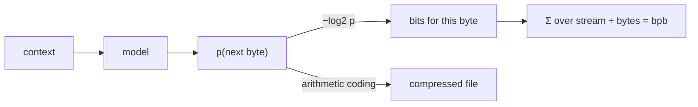

# Compression = prediction (and what bits-per-byte means)

## Intuition

A model that assigns probability p to the next byte can be turned into a compressor that stores
that byte in **−log₂ p bits** (arithmetic coding), and vice versa. So *predicting well* and
*compressing well* are the **same objective**. There is no difference between "a language model"
and "a compressor" at the level of the math — only in how you package and reuse the artifact.

## bits-per-byte (bpb)

The average cost, in bits, to encode each byte of held-out text:

> **bpb = (1 / n_bytes) · Σ −log₂ p(byte_i | context_i)**

It's just cross-entropy measured in bits and normalized per byte. Byte-level → no tokenizer
choices muddy the comparison. Lower is better. Random ASCII English is ~4–5 bpb; good models on
enwik8 reach ~1 bpb; the [Hutter Prize](http://prize.hutter1.net) frontier is ~0.9 bpb.

## Picture

## Worked example

Suppose after "the cat sat on the ma" the model puts p('t') = 0.5. Cost = −log₂ 0.5 = **1 bit**
for that byte. If it were more confident, p('t') = 0.9 → −log₂ 0.9 ≈ **0.152 bits**. Summing
these costs over the whole eval stream and dividing by the byte count gives bpb. So "lower bpb"
literally means "less surprised, byte by byte."

## Why it matters here

It means chasing low bpb-per-FLOP *is* chasing a better predictive model — and lets us borrow
the entire compression literature (e.g. context mixing) as inspiration and as a ceiling.

## See also
[bits in scaling context](loss-per-flop-and-scaling-laws.md) · [Prequential evaluation](prequential-evaluation.md)
