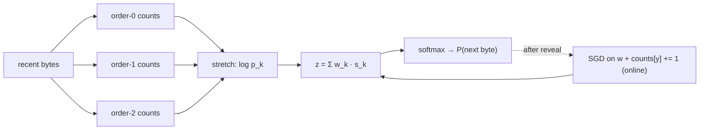

# Online context mixing (the reference ceiling)

> A **reference, not a candidate.** This page describes a yardstick — the bpb-per-FLOP that
> single-pass online learning can reach — not an entrant in the search. It tells us what a real
> candidate should try to approach.

## Intuition

Our metric *is* the [Hutter Prize](../../candidates.md): bits-per-byte on enwik8. And the best
results there are **not** trained transformers — they are **online context-mixing** compressors
(PAQ / cmix / nncp). Their recipe is almost embarrassingly simple:

1. Keep a **handful of cheap specialists**, each a different "if you only looked at *this* much
   context, what comes next?" model. Here: order-0 (global byte frequency), order-1 (frequency
   given the last byte), order-2, order-3 (given the last 2–3 bytes).
2. **Mix** their predictions into one distribution.
3. Learn the **mixing weights online**, in a single streaming pass — no pretraining, no backprop
   through a deep net. Every byte: predict, get graded, nudge the weights, fold the byte into the
   counts, move on.

Because it learns entirely while reading ([transductive](../concepts/compression-equals-prediction.md)),
it is a pure expression of [Source-(iv)](source-iv-advantage.md): *lots of loss-reduction per
FLOP*. It carries **zero pretrained parameters** and still reaches far lower bpb than an
untrained transformer at a tiny fraction of the compute.

## The math

**Each specialist** is a smoothed conditional frequency table. For order-k, with the last `k`
bytes as context, let `c_k[b]` be how many times byte `b` has followed that context. Add-α
(Laplace) smoothing turns counts into a probability:

```
p_k[b] = (c_k[b] + α) / (Σ_b c_k[b] + α·V)        V = 256
```

An unseen context (all-zero counts) gives the **uniform** distribution — the specialist abstains.

**Logistic mixing.** PAQ combines binary predictors as `squash(Σ_k w_k · stretch(p_k))` with
`stretch = logit`, `squash = sigmoid`. The 256-class generalisation uses `log` as the stretch and
`softmax` as the squash:

```
s_k[b] = log p_k[b]                      (stretch)
z[b]   = Σ_k w_k · s_k[b]                (mix in log-space = weighted product of experts)
P[b]   = softmax(z)[b]                   (squash)
```

We return `z` as the length-256 logits; the harness applies `log_softmax(z)`, recovering exactly
`−log₂ P[y]` bits for the true byte `y`.

**Online weight learning.** The mixer is one-layer multinomial logistic regression on the
features `s_k`. After byte `y` is revealed, take one SGD step on the cross-entropy
`L = −log P[y]`. The softmax-CE gradient is clean and hand-checkable:

```
∂L/∂z[b] = P[b] − 1{b = y}
∂z[b]/∂w_k = s_k[b]
⇒  ∂L/∂w_k = Σ_b (P[b] − 1{b = y}) · s_k[b]
w_k ← w_k − lr · ∂L/∂w_k
```

Then the byte is folded into every order-k count table (`c_k[y] += 1`), so the next prediction is
already a little better. That is the entire learning algorithm.

## FLOP honesty (why this is the right test for the primitives)

This mechanism's dominant compute is **not** matmuls — it is **table lookups, count updates, and
the logistic mix/update**, all `O(K·V)` per byte (`K` = number of specialists). The shared
[FLOP counter](loss-per-flop-and-scaling-laws.md) omits elementwise work for the transformer
*only because matmuls dominate there*; that omission is **conditional**. So every per-byte
operation here is charged through the non-matmul primitives `pointwise_flops` / `gather_flops`.
Each step charges **exactly the branches it actually runs** (`ContextMixing._flop_breakdown`) —
not a constant per-byte estimate, which would over-charge early bytes and abstaining specialists.
With `K` predictors and `V = 256`, where `n_active` = specialists with available context this
byte, `n_seen` = those whose exact context was seen before, `n_fold` = orders folded:

| phase | work | FLOPs |
| --- | --- | --- |
| predict | one lookup per available specialist | `gather(n_active)` |
| predict | Laplace prob (`≈3V`) only for the `n_seen` seen contexts | `pointwise(3V·n_seen)` |
| predict | stretch `log p_k` (every predictor) + mix (`2KV`) + softmax (`5V`) | `pointwise(KV + 2KV + 5V)` |
| adapt | `n_fold` count increments + their lookups | `pointwise(n_fold)` + `gather(n_fold)` |
| adapt | mixer update *only if a prediction is pending*: one-hot subtract (`1`) + gradient (`2KV`) + weight step (`2K`) | `pointwise(1 + 2KV + 2K)` |

So byte 0 (no pending prediction, empty context) is cheap; a fully-warmed byte costs more. In
steady state (`K = 4`, all specialists active and seen) that is ≈ 9.5k FLOPs/byte — small, but
**counted to the FLOP**. Leaving it uncharged would let the reference look artificially free; the
whole point of the primitives is that it does not.

## Worked example

Two specialists, a 2-symbol alphabet, mixing weights `w = [0.5, 0.5]`.

- Stretched inputs (already `log p`): `s = [[1, 3], [5, 7]]`.
- Mix: `z = 0.5·[1,3] + 0.5·[5,7] = [3, 5]`.
- Squash: `P = softmax([3,5]) = [e⁻²,1]/(1+e⁻²) ≈ [0.119, 0.881]`.

The true byte is `0`. The error is `P − onehot(0) = [0.119−1, 0.881] = [−0.881, 0.881]`, so the
gradient per specialist is `Σ_b err[b]·s_k[b]`:

```
g_0 = (−0.881)(1) + (0.881)(3) = 1.76
g_1 = (−0.881)(5) + (0.881)(7) = 1.76
```

With `lr = 0.1`, `w ← [0.5, 0.5] − 0.1·[1.76, 1.76] = [0.324, 0.324]`. Both weights shrink because
both specialists put more mass on byte `1` than the truth warranted — the mixer learns to trust
sharp-but-wrong inputs less. (A `K=1`, `V=3` version of exactly this is asserted in
`tests/test_context_mixing.py::test_one_sgd_step_lowers_loss_on_the_revealed_byte`.)

## Picture



## What the curve says

On the bundled English sample, adding orders walks the bpb-vs-FLOP frontier *down*
(4.71 → 4.17 bpb as the per-byte FLOPs roughly triple) while an untrained transformer sits at
≈8.0 bpb spending **~450× more** compute. That gap is the ceiling a candidate is chasing — see the
[experiment log](../experiments/index.md).

## See also

[Compression = prediction](compression-equals-prediction.md) ·
[Prequential evaluation](prequential-evaluation.md) ·
[Source-(iv) advantage](source-iv-advantage.md) ·
[Fast-weight memory](fast-weight-memory.md)
