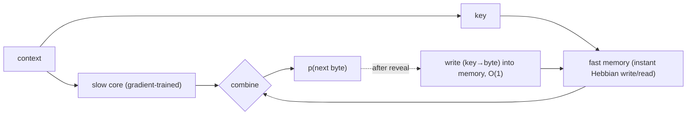

# Fast-weight associative memory (Phase A maiden candidate)

## Intuition

A language model spends a surprising amount of capacity (and gradient compute) **memorizing**
literal patterns — names, rare words, exact phrasings. Gradient descent is an expensive way to
memorize: many steps to push facts into weights. What if memorization were nearly **free**?

A **fast-weight associative memory** stores key→value associations with a single instant write
(a Hebbian outer product, or a modern-Hopfield update) — **no gradient, O(1) per item**. Pair it
with a small **slow core** trained by gradients to do the *generalization*. The division of
labor: the slow core learns the regularities; the fast memory soaks up the rote bits the moment
it sees them.

## The Source-(iv) story

If rote memorization moves from "expensive gradient steps" to "one cheap write," then the
gradient FLOPs all go toward *generalization* → **more loss-reduction per FLOP**. That's a
genuine [Source-(iv)](source-iv-advantage.md) claim, not a parallelism trick. And because the
memory writes online as it reads, it's a true **continual learner** — its adaptation FLOPs are
counted under [prequential evaluation](prequential-evaluation.md), so it can't cheat.

## Picture

## Worked example (the bet)

Stream hits a rare proper noun "Zelenograd" for the first time. A pure gradient model is
surprised every early occurrence until many updates pass (high bpb on those bytes). The hybrid
writes "context→next byte" into fast memory on first sight; the *next* occurrence is partly
predicted by an O(1) read → lower bpb on repeats, with almost no extra FLOPs. The empirical
question Phase A answers: **does that buy enough bpb-per-FLOP to beat the transformer baseline on
the curve?** We will log the answer (win or lose) in the [experiment log](../experiments/index.md).

## Open design questions (to grill before building)
- Memory addressing: exact key match vs. soft/attention-style retrieval (modern Hopfield)?
- Capacity & eviction: fixed-size memory → what gets forgotten?
- How are memory reads/writes FLOP-counted fairly vs. the core?

## See also
[Source-(iv) advantage](source-iv-advantage.md) · [Prequential evaluation](prequential-evaluation.md)
