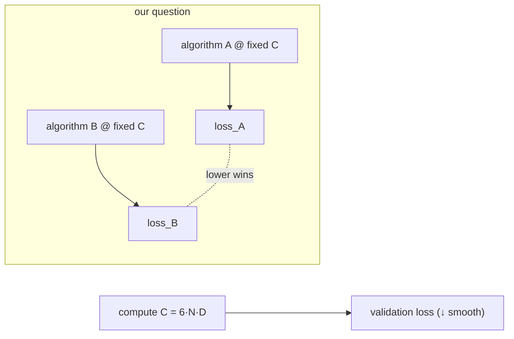

# Loss-per-FLOP & scaling laws

## Intuition

Training compute is roughly **C ≈ 6 · N · D** FLOPs, where N = parameters, D = tokens seen.
(The 6 ≈ 2 for the forward pass + ~4 for the backward pass, per parameter per token.) Empirical
**scaling laws** (Kaplan 2020; Hoffmann/"Chinchilla" 2022) say validation loss falls smoothly
and predictably as you grow C, N, and D together. This is *measured*, not folklore — which is
why "GPT-3 needs billions" is arithmetic, not psychology.

GPT-3: N≈175e9, D≈300e9 → C ≈ 6·175e9·300e9 ≈ **3.15e23 FLOPs**. A strong laptop GPU at ~2e13
FLOP/s would take ~1.5e10 s ≈ **~500 years** at 100% utilization. The algorithm being simple
(a transformer fits on a napkin) says nothing about this cost — *simplicity of the kernel ≠
cheapness of training*. That category error is the whole trap.

## Why we measure *per FLOP*

If we want a *fundamentally* cheaper learner, the fair question is: at the **same FLOP budget**,
who reaches lower loss? FLOPs are hardware- and language-agnostic, so the comparison is honest
across a MacBook, an AMD card, or a rented GPU. See [bits-per-byte](compression-equals-prediction.md)
for the loss unit and [prequential evaluation](prequential-evaluation.md) for *how* we count.

## Picture

## Worked example

Two models, same budget C = 1e16 FLOPs on enwik8. Transformer baseline reaches 1.20 bpb;
candidate reaches 1.15 bpb. The candidate "wins" at this budget — but only the **whole curve**
(bpb vs C across several budgets) tells us if the win holds or is a one-budget fluke.

## See also
[Compression = prediction](compression-equals-prediction.md) · [Source-(iv) advantage](source-iv-advantage.md)
