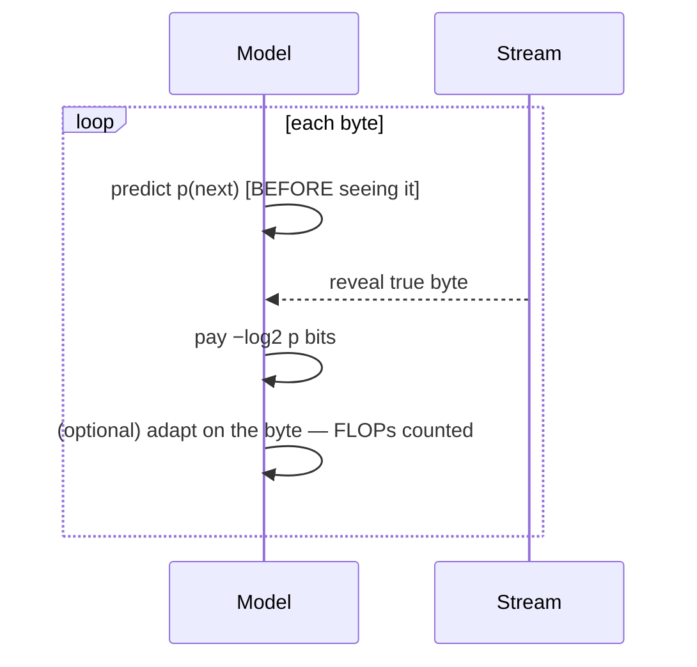

# Prequential evaluation

## Intuition

How do you fairly score a model that **keeps learning** while it reads? Use the **prequential**
(predictive-sequential) principle: at each step the model must **predict the next byte before it
sees it** (paying −log₂ p bits), and only *then* may it adapt on the revealed byte. Sum the bits
→ that's the score. Because every prediction is made *before* the answer is revealed, a model
that memorizes the past **cannot** cheat on the future — so you get an honest generalization
measure **without any held-out split**. (This is Dawid's prequential / online-MDL view; the
cumulative bits equal the compressed length, tying back to
[compression = prediction](compression-equals-prediction.md).)

## Our protocol (ADR 0004)

- Stream = byte-level enwik8. The **final 5 MB is the fixed eval stream** (same for everyone,
  never in the prior corpus). The first ~95 MB is a freely-usable **prior corpus**.
- A model may pretrain on the prior corpus, warm up online, or both — anything, as long as
  **all FLOPs are counted** (pretraining + inference + test-time adaptation).
- Score = cumulative **bpb over the eval stream** at a fixed **total-FLOP budget**, plotted as a
  curve over several budgets.

## Picture

## Why it unifies everything

- **Amortized** model = spends all FLOPs up front, then never adapts.
- **Transductive** model = zero pretraining, learns entirely online.
- **Hybrid** = anything in between.

All three are just points on one curve, compared by the same number — so the *winner* tells us
the best mix instead of us guessing. See [Source-(iv) advantage](source-iv-advantage.md) for
what kind of win counts.

## Worked example

Two systems, total budget 1e16 FLOPs. System X pretrains then freezes: 1.18 bpb on the tail.
System Y pretrains *less* but keeps adapting during the tail (its adaptation FLOPs eat into the
same budget): 1.12 bpb. Y wins — and it couldn't have hidden compute at eval, because that
compute was counted.

## See also
[Compression = prediction](compression-equals-prediction.md) · [Fast-weight memory](fast-weight-memory.md)
