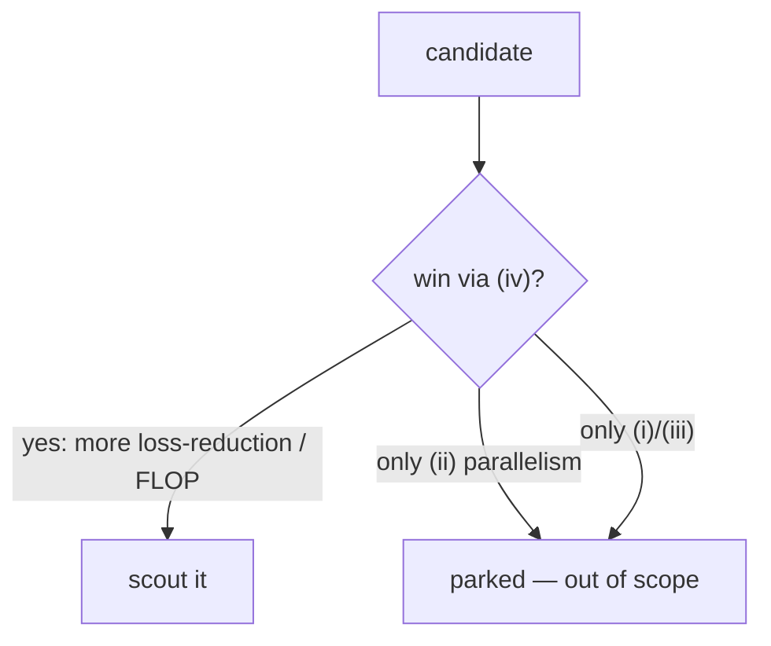

# Source-(iv) advantage

## Intuition

People reach for backprop-free learning for four reasons. Under our **loss-per-FLOP** metric they
are NOT equal:

| Source | Claim | What it actually buys (our metric) |
|---|---|---|
| (i) cheaper credit assignment | "skip the backward pass" | Backward is only ~2× forward, so ceiling ~3×; usually spent back. Modest. |
| (ii) locality → parallelism / async | "no global sync" | **Wall-clock & scaling only — scores ZERO on fixed FLOPs.** Out of scope. |
| (iii) no activation storage | "fits in memory" | Memory only; barely touches FLOPs. |
| **(iv) better learning dynamics** | "the update reduces loss faster per FLOP" | **The only thing that moves our scoreboard.** |

So "no backprop!" by itself is not a win here — backprop is already cheap per FLOP. The whole game
is **(iv)**: does the *update rule itself* extract more loss-reduction from each FLOP?

## The screen (ADR 0003)

Before any candidate earns a GPU-hour, answer: *"Is there a plausible reason this reduces loss
faster **per FLOP** — or is it just avoiding a cheap backward pass / buying parallelism we don't
reward?"* If only (i)/(ii)/(iii), it's parked.

## Picture

## Worked example

*Forward-Forward* replaces the backward pass with a second forward pass and a local objective.
Sounds efficient — but two forwards ≈ the cost of one forward+backward, so its (i) saving is ~0,
and its big selling point is really (ii) locality. With no distinct (iv) story, it's **parked**
here (not forbidden — fair as inspiration).

## See also
[Loss-per-FLOP](loss-per-flop-and-scaling-laws.md) · [Fast-weight memory](fast-weight-memory.md)
