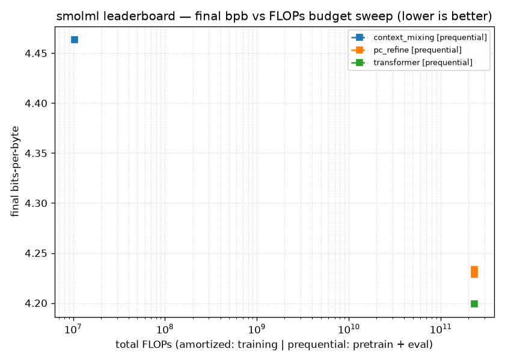

# Experiment B.1 — surprise-gated predictive-coding refinement

**Status:** mechanism sound and honestly metered; **the Source-(iv) gating *lever* is real and
directional, but the mechanism is Pareto-hollow on this data.** Surprise-gated settling does
beat uniform settling at matched FLOPs (−0.0045 bpb) — but the whole PC-refinement layer
*hurts* the frozen core it sits on (+0.034 bpb) while costing *more* FLOPs, and online
context-mixing reaches comparable bpb for ~4 orders of magnitude fewer FLOPs. CI-scale offline
clone; the lesson is the honest accounting and the lever's direction, not the absolute bpb.

## The bet (and why it underwhelms here)

Predictive coding normally *settles uniformly* — every input gets the same number of
error-minimization iterations — and tends to lose per FLOP. The bet: make the settling depth
(and the online update) **surprise-gated**, so loss-reducing compute concentrates on the hard
bytes and skips the easy ones. The [Source-(iv)](../concepts/source-iv-advantage.md) claim is
sharp and falsifiable: *same total FLOPs, lower bpb, because we don't waste settling on easy
bytes.* The gate is intrinsic to the algorithm (iterations), not bolted on — and adaptive-compute
work (ACT/PonderNet) optimizes latency, almost never **bpb-per-FLOP under an honest prequential
total-FLOP count**.

**Measured, the lever points the right way but the mechanism does not pay for itself:**

1. **The gate works, weakly.** At matched total FLOPs the surprise-gated run reaches **4.2288**
   bpb vs the uniform run's **4.2333** — a real −0.0045 bpb, and since the gate is calibrated so
   mean `K ≈ k_uniform`, the two runs spend *identical* eval FLOPs. The win is pure *allocation*.
2. **But PC refinement is net-harmful.** Both `pc_refine` runs are **worse** than just reading
   the frozen transformer core (4.1992 bpb) — by +0.034 (uniform) / +0.030 (gated) — *and* they
   add settling/update FLOPs on top. The cheapest correct predictor at this budget is the bare
   core; the PC layer buys negative loss-per-FLOP.
3. **The ceiling is far cheaper.** Online context-mixing reaches 4.4637 bpb for **1.0e7** FLOPs —
   ~22,000× less than the 2.3e11 the pretrained transformers spend. On the per-FLOP axis the
   online learner dominates the whole pretrained cluster.

So "beats the uniform variant" is true and "good per FLOP" is false — the same trap A.1 fell
into. The gate is a sound idea whose payoff this corpus cannot expose.

## Setup

- **Slow core:** the `transformer` baseline (`d_model=48, n_layers=3`, 95,568 params), pretrained
  by the default backprop `train_step` to a 2e11-FLOP ceiling on the prior corpus and **frozen**
  during eval. Every entrant shares this core (bit-identical), so deltas isolate the PC module.
- **PC module (variant α — logit-correction):** gradient-free runtime state, reset per stream.
  Latent `z ∈ ℝ^32`; generative `W ∈ ℝ^{48×32}` (predicts the hidden `ĥ = Wz`); readout
  `Vmat ∈ ℝ^{32×256}` **initialized to 0** (zero correction = identity to the core at start —
  bounds the worst case, answering the A.1 lesson where a confident-wrong module starves truth).
  - *Inference = settling:* `K` free-energy descent steps `z ← z − η[z/σ_z² − Wᵀ(h−Wz)/σ_h²]`,
    warm-started; refined logits `ℓ = ℓ_core + Vmatᵀz`.
  - *Online learning (gradient-free, local):* readout `ΔVmat = −lr·z(p−e_byte)ᵀ` (the exact CE
    gradient of the linear readout), generative `ΔW = +lr·(h−Wz)zᵀ` (the PC error rule), applied
    via the pending-prediction pattern so the update for byte `pos` uses only byte `pos`
    (no leakage).
- **Surprise gate:** settling depth from a **pre-reveal** proxy (`1 − max softmax(ℓ_core)`,
  z-scored against a running surprise mean/variance so realized mean `K ≈ k_uniform` ⇒ matched
  settling FLOPs); the update fires only when **post-reveal** `−log p(byte) > θ`. `uniform` mode
  fixes `K = k_uniform`; the two runs differ in *only* this field.
- **Baselines on the same stream:** the bare `transformer` core (does PC help at all?) and the
  `context_mixing` reference (the per-FLOP ceiling, [§0.3](context-mixing-reference.md)).
- **Data:** synthetic `text8` clone (`synthetic_text8(8000, seed=0)`), ADR-0004 carve, final
  **1200 bytes** = fixed prequential eval stream; seed 0, CPU.
- **Reproduce:** `uv run python -m smolml.experiments.pc_refine_sweep`.

## FLOP honesty (charge == reality)

PC's dominant compute is small matvecs and elementwise mixing, *not* the big projection matmuls —
exactly the regime the instrument would otherwise score as nearly free. Every op is charged via
`smolml.flops` and returned from `step`: settling charges `Wz`/`Wᵀr` matvecs + the `d`/`5m`
elementwise work per iteration; the readout charges `Vmatᵀz` + add + softmax; the gate charges the
`O(V)` softmax + proxy; the applied update charges the residual recompute, `p−e_byte`, the two
rank-1 outer products, *and the per-matrix combine/decay*. `K` is data-dependent, so total eval
FLOPs are summed per byte, not estimated.

> **Cross-vendor review caught a real undercharge.** The first cut charged the update's two
> rank-1 outers + one decay pass, but the elementwise combine (`keep`-scale + `lr`-scale + add/sub
> over `d·m` and `m·V`) is the *same order* as those outers — so the `smolml.flops`
> dominated-elementwise exception does **not** apply. It is now charged in full. This shifted only
> absolute FLOPs (both runs equally); the matched-FLOP comparison is unchanged.

## Result

All four entrants on the identical 1200-byte eval stream (lower-left is better):

| run | bpb | total FLOPs | pretrain | eval |
| --- | ---: | ---: | ---: | ---: |
| transformer (core only) | **4.1992** | 2.311e11 | 1.999e11 | 3.123e10 |
| pc_refine **gated** (surprise) | 4.2288 | 2.312e11 | 1.999e11 | 3.135e10 |
| pc_refine uniform | 4.2333 | 2.312e11 | 1.999e11 | 3.135e10 |
| context_mixing (reference) | 4.4637 | **1.036e7** | 0 | 1.036e7 |

- **[iv] gated vs uniform:** Δbpb = **−0.0045** at **1.000×** uniform total FLOPs → the gate wins
  on allocation alone.
- **pc_refine vs bare core:** Δbpb = **+0.0341** (uniform − transformer) → the PC layer hurts.

## Verdict

**Lever real, mechanism Pareto-hollow on this data.** The surprise gate extracts a small,
honest, allocation-only win over uniform settling — the (iv) *direction* is confirmed. But the
PC-refinement mechanism as a whole loses per FLOP: it is dominated by the frozen core it refines
and, on the per-FLOP axis, by online context-mixing. The (iv) *claim* is **not supported** here.

## What we learned

1. **The gate needs a trained core to bite.** The surprise proxy is `1 − max p`; on an *order-0*
   synthetic corpus a barely-trained core produces near-constant per-byte surprise, so the gate is
   degenerate (gated == uniform, bit-identical) below ~2e11 pretrain. The lever only appears once
   the core is trained enough to be *differentially* confident — a structural prerequisite, not a
   tuning detail.
2. **Order-0 data starves the lever.** With weak per-byte difficulty structure there is little to
   allocate, so even the non-degenerate win is tiny. A fair test of "concentrate compute on hard
   bytes" wants data with genuine difficulty variation (**real enwik8**) — out of scope for the
   offline CPU runner, and the natural next control.
3. **The A.1 reflex, again.** Beating an internal uniform variant is not a per-FLOP win. Always
   put the **bare core** and the **context-mixing reference** on the bpb-vs-FLOP curve before
   claiming anything — here both dominate the candidate.
4. **Honest accounting is the real deliverable.** The cross-vendor-caught update undercharge is
   exactly the failure mode the project guards against; the candidate is trustworthy because every
   FLOP it spends is on the curve.

## Next

Config **(b)** — a *pure-PC* core (no backprop anywhere) + variant **β** (full PC readout) — is
gated on a real-enwik8 test of (c)/α showing the gate lever actually buys per-FLOP loss reduction
where difficulty structure exists. On this evidence, that test comes *before* any further PC
investment.
