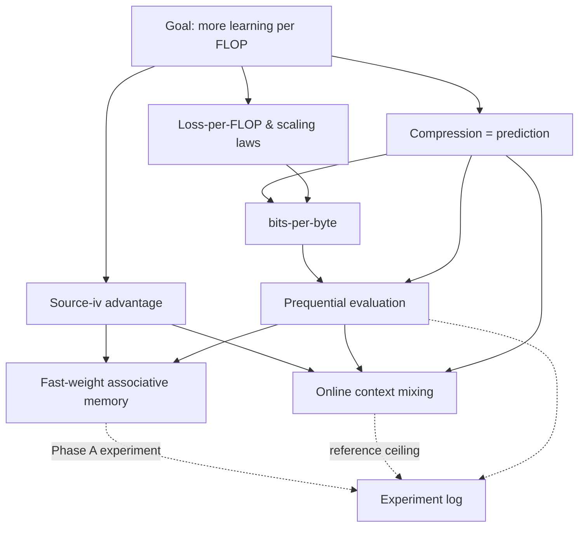

# The smolml compendium

An ever-growing hypertext map of everything we learn while hunting for a more compute-efficient
learning algorithm. Every concept gets a page (explanation + a picture + a worked example);
every experiment gets a log entry. No orphan pages — link generously.

> How to contribute: see the **standing directive** in [`../../AGENTS.md`](../../AGENTS.md).

## Concept map

## Concepts

- [Loss-per-FLOP & scaling laws](concepts/loss-per-flop-and-scaling-laws.md) — why "needs
  billions" is arithmetic, and why we measure *per FLOP*.
- [Compression = prediction](concepts/compression-equals-prediction.md) — why a good predictor
  *is* a good compressor, and what **bits-per-byte** means.
- [Prequential evaluation](concepts/prequential-evaluation.md) — scoring a model that keeps
  learning, honestly, with no held-out split.
- [Source-(iv) advantage](concepts/source-iv-advantage.md) — the only kind of "win" a
  non-backprop idea is allowed to claim here.
- [Fast-weight associative memory](concepts/fast-weight-memory.md) — the Phase A maiden
  candidate: make memorization ~free.
- [Online context mixing](concepts/context-mixing.md) — the PAQ/cmix reference ceiling (not a
  candidate): cheap order-k models + online logistic mixing, the bpb-per-FLOP target to approach.

## Experiments

- [Experiment log](experiments/index.md) — what we tried, the curves, and what we learned
  (failures included — they're the data).
